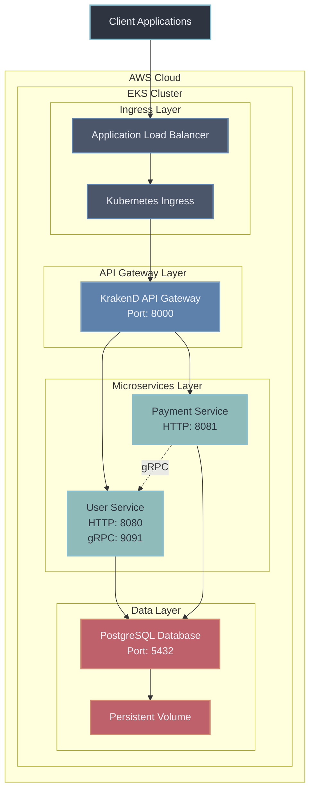
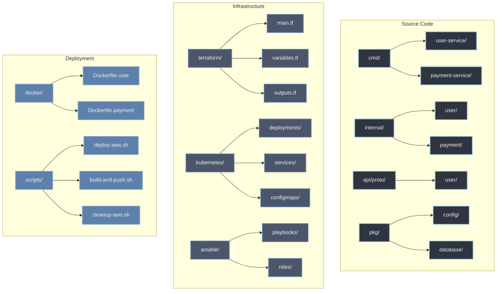
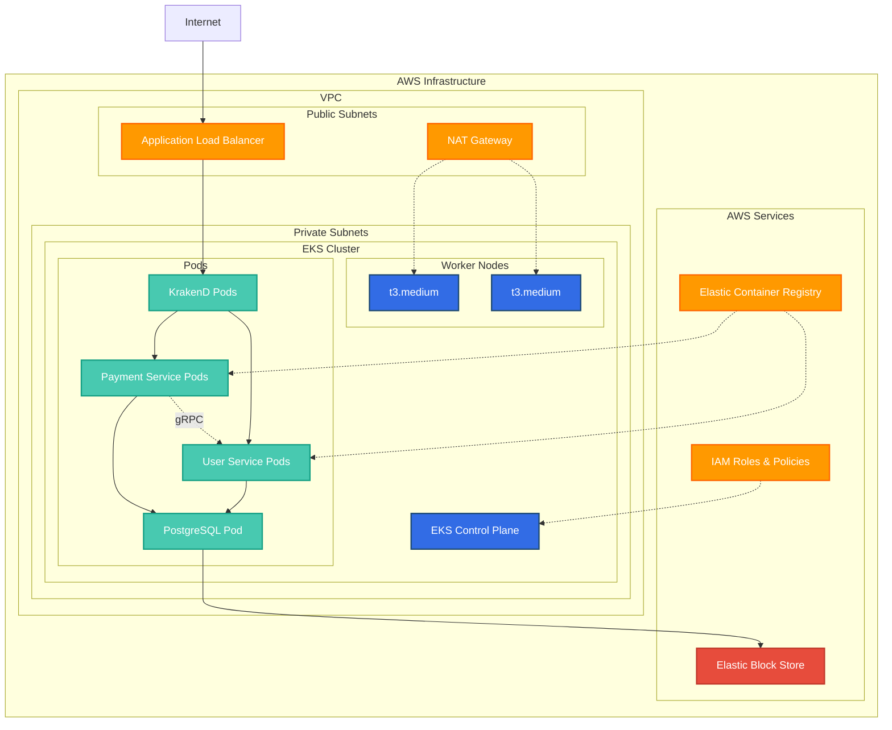

# Kubedeploy EKS

Production-ready microservices architecture built with Go, gRPC, PostgreSQL, and KrakenD API Gateway, designed for deployment on AWS EKS.

## Architecture



## Deployment Flow

```mermaid
flowchart LR
    A[Source Code] --> B[Docker Build]
    B --> C[ECR Push]
    C --> D[Terraform Apply]
    D --> E[EKS Cluster]
    E --> F[Ansible Deploy]
    F --> G[Running Application]
    
    classDef source fill:#2E3440,stroke:#88C0D0,stroke-width:2px,color:#ECEFF4
    classDef build fill:#4C566A,stroke:#5E81AC,stroke-width:2px,color:#ECEFF4
    classDef deploy fill:#5E81AC,stroke:#81A1C1,stroke-width:2px,color:#ECEFF4
    classDef infra fill:#8FBCBB,stroke:#88C0D0,stroke-width:2px,color:#2E3440
    classDef app fill:#BF616A,stroke:#D08770,stroke-width:2px,color:#ECEFF4
    
    class A source
    class B,C build
    class D,F deploy
    class E infra
    class G app
```



## Quick Start

### Prerequisites
- Docker & Docker Compose
- AWS CLI (for EKS deployment)
- Terraform (for infrastructure)
- kubectl (for Kubernetes management)

### Local Development
```bash
make start          # Start local environment
make test          # Run API tests
make stop          # Stop local environment
```

### AWS EKS Deployment
```bash
make deploy-aws    # Full automated deployment
```

## API Endpoints

All requests go through the API Gateway at `http://localhost:8000`

### Users API
```bash
# Get all users
GET http://localhost:8000/api/users

# Create a user
POST http://localhost:8000/api/users
Content-Type: application/json
{
  "username": "johndoe",
  "email": "john@example.com",
  "password": "password123"
}

# Get user by ID
GET http://localhost:8000/api/users/{id}

# Update user
PUT http://localhost:8000/api/users/{id}
Content-Type: application/json
{
  "username": "newusername",
  "email": "newemail@example.com"
}

# Delete user
DELETE http://localhost:8000/api/users/{id}
```

### Payments API
```bash
# Get all payments
GET http://localhost:8000/api/payments

# Create a payment
POST http://localhost:8000/api/payments
Content-Type: application/json
{
  "user_id": 1,
  "amount": 99.99,
  "currency": "USD",
  "description": "Product purchase"
}

# Get payment by ID
GET http://localhost:8000/api/payments/{id}

# Get user's payments
GET http://localhost:8000/api/payments/user/{userId}
```

### Dashboard API
```bash
# Get dashboard data (users + payments)
GET http://localhost:8000/api/dashboard
```

## Development

### Available Make Commands
```bash
# Local Development
make start          # Start the entire system
make stop           # Stop the entire system
make test           # Run all tests
make build          # Build all services

# AWS Deployment
make deploy-aws     # Full AWS deployment
make build-push     # Build & push to ECR
make cleanup-aws    # Destroy everything

# Kubernetes Operations
make k8s-deploy     # Deploy to K8s
make k8s-status     # Check status
make k8s-logs       # View logs

# Terraform Operations
make tf-plan        # Plan infrastructure
make tf-apply       # Apply infrastructure
make tf-destroy     # Destroy infrastructure
```

### Direct Service Access (Development Only)
- User Service: `http://localhost:8080`
- Payment Service: `http://localhost:8081`
- PostgreSQL: `localhost:5432` (user: postgres, password: postgres, db: userdb)

## Project Structure



## Technology Stack

- **Backend**: Go 1.23, gRPC, PostgreSQL 15, GORM
- **API Gateway**: KrakenD 2.7
- **Infrastructure**: AWS EKS, Terraform, Ansible
- **Containerization**: Docker, Kubernetes
- **Architecture**: Clean Architecture, Microservices

## Infrastructure Overview



## Production Deployment

The system is designed for production deployment on AWS EKS with:

- High availability across multiple AZs
- Auto-scaling worker nodes
- Persistent storage for PostgreSQL
- Load balancing with AWS ALB
- Container registry with ECR
- Infrastructure as Code with Terraform
- Automated deployment with Ansible


